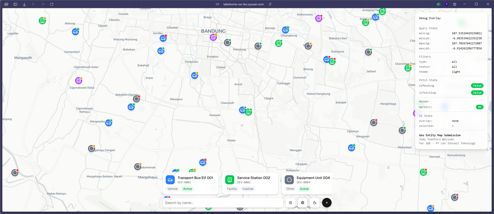
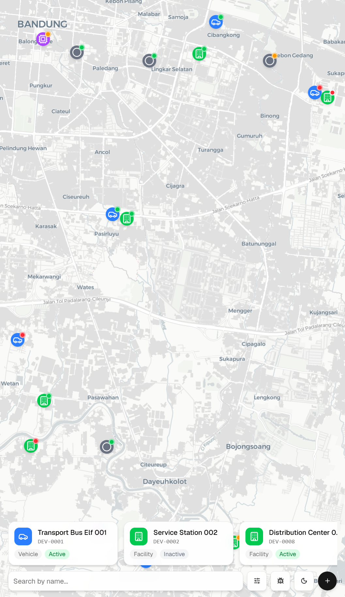
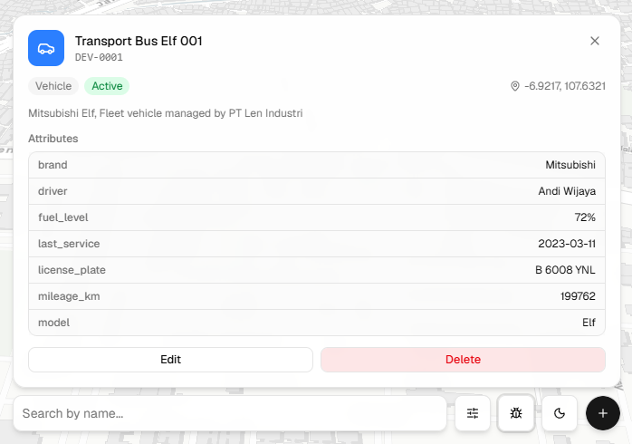
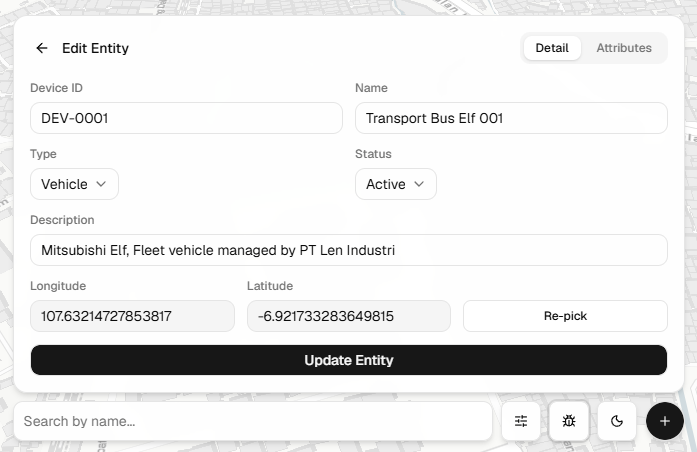
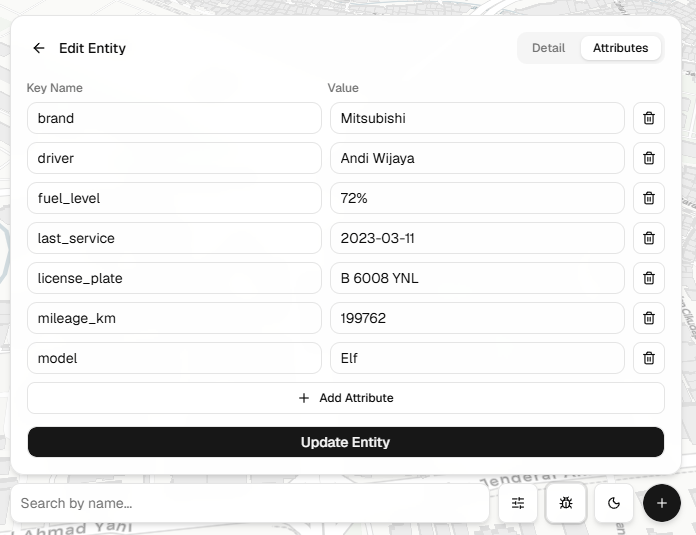
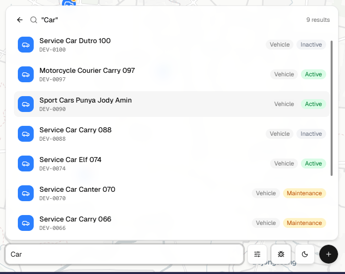
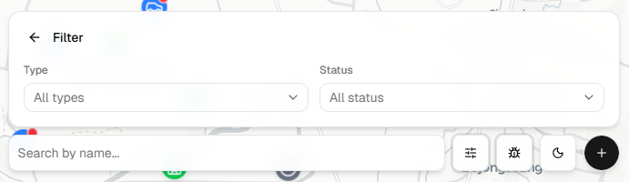
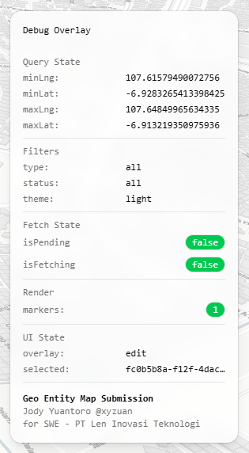

# Geo Entity Map App



An application to display and manage geo-located entities (vehicles, IoT devices, facilities) on an interactive map. Built as a take-home test.

## Prerequisites

- Docker (tested with v29.7)
- Docker Compose (tested with v5.4)

## Running the App

```bash
docker compose up -d --build
```

- Frontend: http://localhost:5173
- Backend API: http://localhost:8080/api
- Database: localhost:5432 (user: geo, password: geo, db: geoapp)

The first start seeds 100 demo entities in a circular distribution around Bandung (centered on PT Len Industri).

## Features

| Preview | Feature Name | Description |
|---------|--------------|-------------|
|  | Viewport Entity Rendering | PostGIS `ST_Within` bbox query returns only entities within the map viewport for lightweight marker rendering. |
|  | Entity Detail | Click a marker to view full entity details (type, status, coordinates, attributes) in a floating card. |
|  | Edit Entity — Detail | Inline edit form with device ID, name, type, status, description, and coordinates. |
|  | Edit Entity — Attributes | Key-value FieldArray editor for entity attributes with add/remove rows. |
|  | Search Entities | Backend-side ILIKE name search with paginated infinite scroll results. |
|  | Filter Entities | Filter entities by type and status via query params on both map and list endpoints. |
|  | Bottom Navigation | Expandable action buttons (Add, Filter, Dark Mode, Debug) with smooth hover animations. |
|  | Debug Overlay | Live diagnostics panel showing bbox, filters, fetch state, and render counts. |

## API Endpoints

| Method | Path | Purpose |
|--------|------|---------|
| GET | /api/entities/map?bbox=minLng,minLat,maxLng,maxLat | entities in viewport (PostGIS) |
| GET | /api/entities?page=1&per_page=20 | paginated list |
| GET | /api/entities/:id | single entity |
| POST | /api/entities | create |
| PUT | /api/entities/:id | full replace |
| DELETE | /api/entities/:id | delete |

## Library Choices

### Backend

| Library | Purpose | Reason |
|---------|---------|--------|
| Gin | HTTP router with JSON binding and middleware | Lightweight footprint and built-in validation integration |
| GORM | Go ORM for queries and CRUD | Data access only (not AutoMigrate); schema managed by explicit SQL migrations |
| go-playground/validator | Struct-tag validation | Serves the PRD's backend validation requirement; custom validators for lat/lng ranges |
| gogis (github.com/restayway/gogis) | PostGIS geometry types for GORM | Point/LineString/Polygon implementing sql.Scanner and driver.Valuer; battle-tested WKB/WKT serialization |
| PostgreSQL + PostGIS | Database | Stores location as `geometry(Point, 4326)`; enables spatial queries (ST_Within for viewport filtering) |

### Frontend

| Library | Purpose | Reason |
|---------|---------|--------|
| React 19 + TypeScript + Vite | UI framework + build tooling | Modern, fast HMR, strong typing |
| Tailwind CSS + shadcn/ui | Styling + component primitives | Utility-first styling + accessible primitives (Dialog, Sheet, AlertDialog, Select) for floating overlay UI |
| mapcn (MapLibre GL) | Map rendering | Free map components, zero-config CARTO tiles, no API key needed; styled with Tailwind, integrates with shadcn |
| TanStack Query | Server state management | Caching, optimistic updates, and auto-refetch |
| react-hook-form + zod | Form state + schema validation | Mirrors backend validation rules on the client |
| Zustand | Ephemeral UI state | Minimal state for pick mode, selected entity, active overlay |
| lucide-react | Icons | Marker styling by entity type |

## Agentic AI Workflow

This project was built using Agentic AI (opencode with superpowers). The workflow:

1. **Brainstorming** — Explored requirements, chose tech stack, designed architecture through guided dialogue.
2. **Spec** — Wrote and reviewed a design document covering data model, API contract, validation rules, and UX.
3. **Plan** — Generated a task-by-task implementation plan with full code.
4. **Implementation** — Executed the plan task by task, verifying each step.

See `AGENTS.md` for AI agent configuration details.
